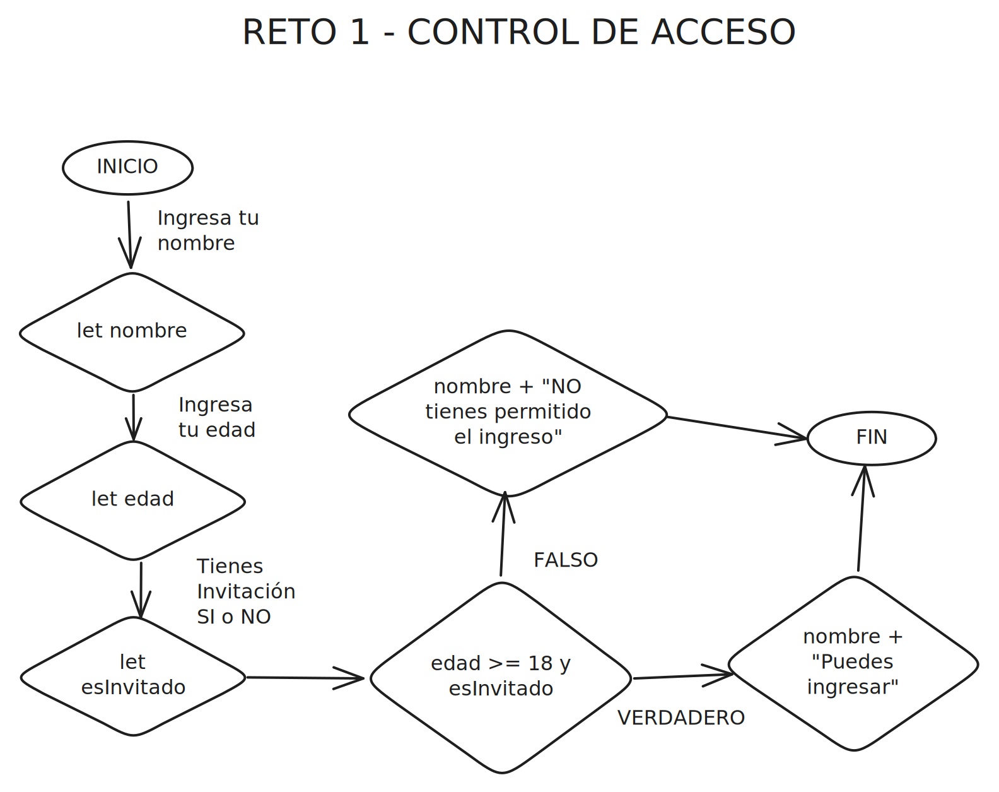
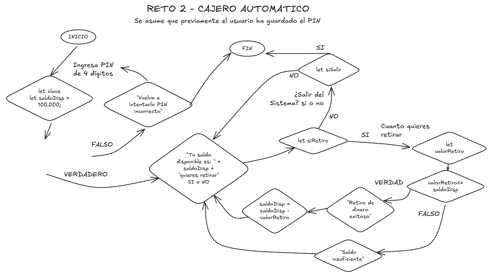
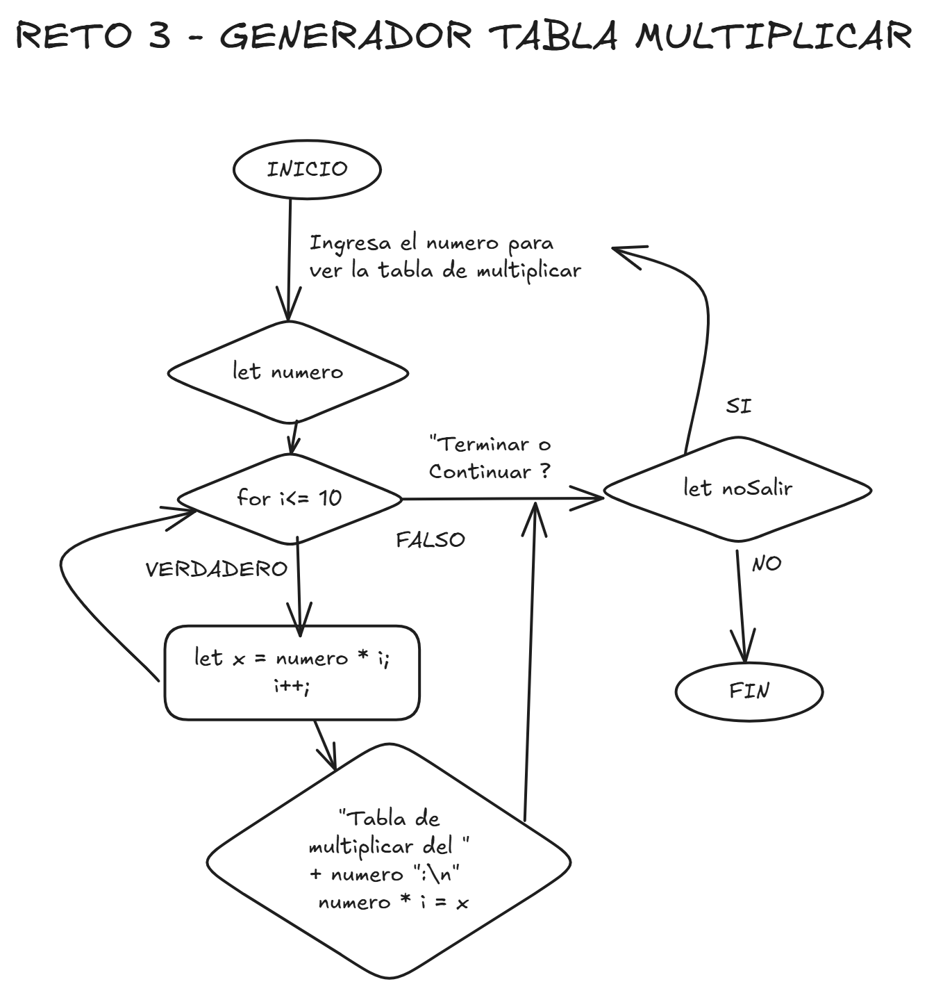

<h1>Desarrollo retos en JavaScript</h1>
<h3>Desafio de Logica de programacion en lenguaje JavaScript.</h3>

 

Se presentan tres desarrollos usando: 

<ul>
    <li>Variables y tipos de datos.  Incluye.</li>
    <li>Condicionales: if, else</li>
    <li>Ciclos: for y while</li>
    <li>Funciones que ejecutan los retos</li>
</ul>

<h3>🔸 Reto 1. Control de Acceso</h2>
<h5>📝Descripcion</h4>

Validar si la persona cumplia con los requisitos para ingresar a la empresa como invitado. 
Valida con un mesaje personalizado si tiene 18 años o mas y si cuenta con invitacion. 

<h5>Diagrama flujo Control de acceso</h5>

<h3>🔸 Reto 2. Cajero Automatico</h2>
<h5>📝Descripcion</h4>
Este reto simula un cajero automático que permite al usuario ingresar con un PIN, le muestra su saldo y le permite retirar dinero y salir del sistema. 
<h5>Diagrama flujo Control de acceso</h5>

<h3>🔸 Reto 3. Tablas de multiplicar</h2>
<h5>📝Descripcion</h4>
Generador de tabla de multiplicar del 1 al 10 interactivo, permite al usuario ingresar el número para ver la tabla completa. 
<h5>Diagrama flujo Control de acceso</h5>

 
<h5>Tecnologías Utilizadas:</h5> 

- HTML
- JavaScript (puro) 

_____________________________________________
<h4>Autor</h4>
<h6>Laura Paola Daza.</h6>

<h6>Fue desarrollado como parte de Cuso Desarrollo web de BIT.</h6>